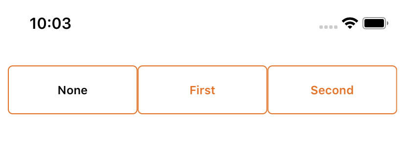

# Xamarin.Forms.SegmentedButton

SegmentedButtonGroup is like iOS Segmented Controls for Xamarin.Forms

###### This is the component, works on iOS, Android and UWP.

<a href="#">
</a>

**NuGet**

|Name|Info|
| ------------------- | :------------------: |
|SegmentedButton|[](https://https://www.nuget.org/packages/Xamarin.Forms.SegmentedButton/)|

**Platform Support**

SegmentedButton is a .NET Standard 2.0 library.Its only dependency is the Xamarin.Forms

install the package in the shared project

in the Xaml file we must declare our control xmlns:sb="clr-namespace:Xamarin.Forms.SegmentedButton;assembly=Xamarin.Forms.SegmentedButton", for example .

```csharp

<sb:SegmentedButtonGroup DefaultColor="#E06F23" SelectedColor="Black" SelectedIndex="{Binding SelectedIndex, Mode=TwoWay}" CornerRadius="5" HeightRequest="50" Margin="8, 8, 8, 0">
                <sb:SegmentedButtonGroup.LabelStyle>
                    <Style TargetType="Label">
                        <Setter Property="FontSize" Value="12" />
                        <Setter Property="FontAttributes" Value="Bold" />
                    </Style>
                </sb:SegmentedButtonGroup.LabelStyle>
                <sb:SegmentedButtonGroup.SegmentedButtons>
                    <sb:SegmentedButton Title="None" />
                    <sb:SegmentedButton Title="First"/>
                    <sb:SegmentedButton Title="Second"/>
                </sb:SegmentedButtonGroup.SegmentedButtons>
            </sb:SegmentedButtonGroup>
```

The complete example can be downloaded here: https://github.com/TBertuzzi/Xamarin.Forms.SegmentedButton/tree/master/SegmentedButtonSample
